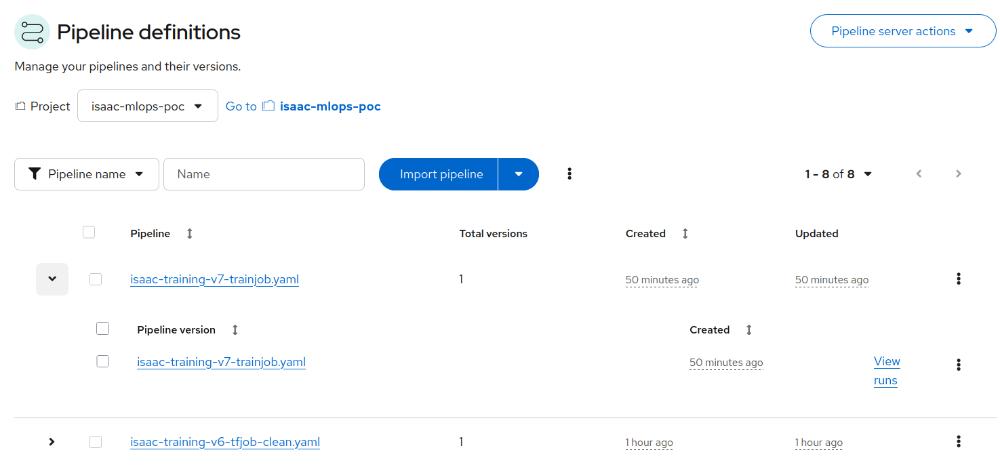
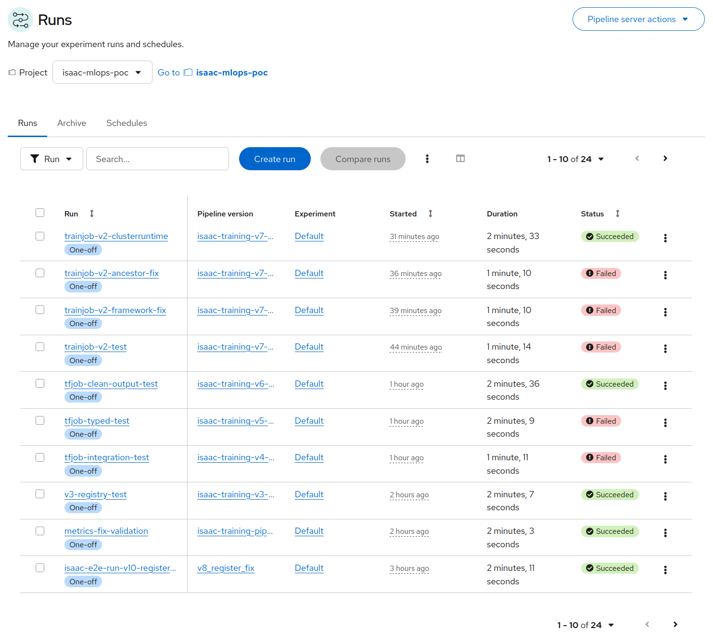
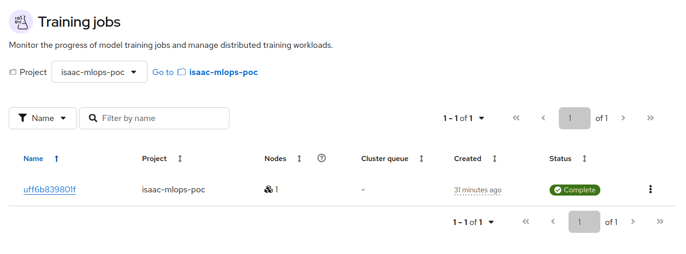
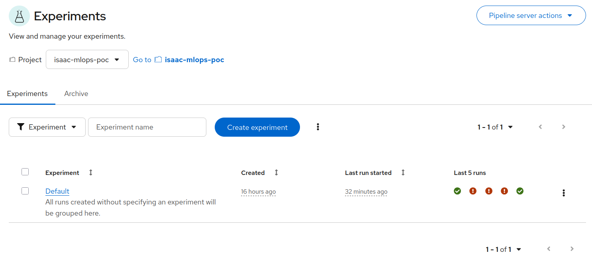

# NVIDIA Isaac MLOps on OpenShift AI

Automated MLOps pipeline for NVIDIA's synthetic data generation and model training workflow, running on OpenShift AI (RHOAI 3.3).

Takes the manual process from NVIDIA's Isaac [Sim Module 3](https://docs.nvidia.com/learning/physical-ai/getting-started-with-isaac-sim/latest/synthetic-data-generation-for-perception-model-training-in-isaac-sim/index.html) — generate synthetic images, convert annotations, train an object detection model, evaluate results — and wraps it in a single parameterized pipeline with experiment tracking, model registration, and live inference serving.

> [!NOTE]
> This project was developed with assistance from AI tools.
>
## What It Does

```
Isaac Sim (generate synthetic palletjack images)
  → TAO Toolkit (convert to TFRecords)
    → Kubeflow Trainer (train DetectNet_v2 as a TrainJob)
      → TAO Export (HDF5 → ONNX)
        → MLflow + Model Registry (log metrics, upload ONNX to S3, register model)
          → KServe InferenceService (deploy ONNX model via OVMS)
```

All orchestrated by Data Science Pipelines (KFP v2) on OpenShift AI with GPU scheduling via the NVIDIA GPU Operator. Training jobs are visible in the RHOAI Training Jobs dashboard. The trained model is automatically exported to ONNX and deployed as a live inference endpoint via OpenVINO Model Server (OVMS).

## Prerequisites

- OpenShift 4.x with RHOAI 3.3+ (DSPA, MLflow operator, Kueue, Kubeflow Trainer)
- NVIDIA GPU Operator with an L40S or equivalent GPU node
- NGC API key ([get one here](https://org.ngc.nvidia.com/setup/api-key))
- TAO Toolkit EULA accepted on [NGC catalog](https://catalog.ngc.nvidia.com/orgs/nvidia/teams/tao/containers/tao-toolkit)

## Quick Start

**1. Deploy infrastructure:**

```bash
helm install isaac-mlops charts/isaac-mlops-poc/ \
  --set ngc.apiKey=<your-key> \
  -n isaac-mlops-poc --create-namespace
```

**2. Post-install (link pull secret to pipeline SA):**

```bash
oc secrets link pipeline-runner-isaac-pipelines ngc-secret \
  --for=pull -n isaac-mlops-poc
```

**3. Compile and submit the pipeline:**

```bash
pip install -r requirements.txt
python pipelines/isaac_training_pipeline.py
# Upload pipelines/isaac_training_pipeline.yaml via the RHOAI dashboard
```

## Key Parameters

| Parameter | Default | Description |
|-----------|---------|-------------|
| `num_frames` | 100 | Synthetic images to generate (5000 for production) |
| `epochs` | 2 | Training epochs (80-100 for production) |
| `batch_size` | 4 | Images per GPU batch |
| `training_runtime` | tao-detectnet | ClusterTrainingRuntime for Kubeflow Trainer |
| `map_threshold` | 0.0 | Minimum mAP to register the model |
| `serving_runtime` | ovms | ServingRuntime: `ovms` (CPU) or `triton` (GPU) |
| `s3_model_bucket` | models | MinIO bucket for KServe model repository |
| `gpu.product` | NVIDIA-L40S | GPU node selector label |

## NVIDIA Container Images

| Image | Purpose | Size |
|-------|---------|------|
| `nvcr.io/nvidia/isaac-sim:4.5.0` | Synthetic data generation (Replicator) | ~15GB |
| `nvcr.io/nvidia/tao/tao-toolkit:5.0.0-tf1.15.5` | TFRecord conversion + DetectNet_v2 training | ~8GB |

## Parameter Sweep

To populate MLflow with comparison data across different configurations, run the parameter sweep script. This submits 5 pipeline runs sequentially, varying `num_frames`, `epochs`, and `batch_size`:

```bash
python pipelines/parameter_sweep.py
```

Runs are submitted one at a time because the data and model PVCs are `ReadWriteOnce` — only one pipeline run can mount them at a time. Each run goes through the full pipeline (data generation → TFRecord conversion → training → evaluation). A baseline run (100 frames, 2 epochs) completes in roughly 12 minutes on an L40S; **expect the full sweep to take about an hour** depending on the parameter combinations.

| Run | num_frames | epochs | batch_size |
|-----|-----------|--------|------------|
| baseline | 100 | 2 | 4 |
| more-frames | 200 | 2 | 4 |
| larger-batch | 100 | 2 | 8 |
| more-epochs | 100 | 4 | 4 |
| combined | 200 | 4 | 8 |

Results are logged to MLflow under the `palletjack-parameter-sweep` experiment for side-by-side comparison.

## OpenShift Security and RBAC

NVIDIA containers are not designed for OpenShift's security model. Both Isaac Sim and TAO Toolkit require `runAsUser: 0` (root), which conflicts with OpenShift's default `restricted` Security Context Constraint (SCC). This section documents the elevated permissions the chart grants and why.

### SCC: anyuid

The `pipeline-runner-isaac-pipelines` service account is granted the `anyuid` SCC via a ClusterRoleBinding. This allows pipeline step pods and TrainJob pods to run as root — a hard requirement for NVIDIA's containers, which write to root-owned paths and expect UID 0.

The ClusterTrainingRuntime explicitly sets `serviceAccountName: pipeline-runner-isaac-pipelines` so that TrainJob pods inherit the same SCC grant. Without this, TrainJobs use the `default` SA and fail with SCC validation errors.

### RBAC grants

The chart creates the following bindings, all scoped to the `pipeline-runner-isaac-pipelines` SA:

| Binding | Scope | Purpose |
|---------|-------|---------|
| `anyuid` SCC | Cluster | NVIDIA containers require root |
| `mlflow-edit` / `mlflow-view` | Cluster | Pipeline steps log to RHOAI MLflow via K8s workspace auth |
| `kueue-trainjob-editor-role` | Namespace | Create/monitor TrainJob resources |
| `cluster-training-runtime-reader` | Cluster | Look up ClusterTrainingRuntime for TrainJobs |
| `training-runtime-reader` | Namespace | Kubeflow SDK checks namespace-scoped TrainingRuntimes first; without read access the lookup returns 403 (not 404), preventing fallthrough to cluster scope |
| `inferenceservice-manager` | Namespace | Pipeline step creates/updates KServe InferenceService for model deployment |

### Cross-namespace resources

The Model Registry components (Postgres, Secret, PVC, ModelRegistry CR) are deployed in `rhoai-model-registries` — the namespace the RHOAI Model Registry operator watches. This is a Helm anti-pattern (resources outside the release namespace), but is required by the operator's design. These resources are tracked by Helm and cleaned up on `helm uninstall`.

### GPU resource management

GPU allocation is managed by Kueue rather than namespace ResourceQuotas. The ClusterQueue defines nominal GPU quotas, and the LocalQueue in the project namespace gates workload admission. All GPU containers specify explicit resource requests and limits for `nvidia.com/gpu`, `cpu`, and `memory`.

## Model Serving

The pipeline automatically deploys the trained model as a KServe InferenceService. The ONNX model is uploaded to MinIO and served via the V2 inference protocol. The default runtime is OVMS (OpenVINO Model Server) for CPU inference; a Triton ServingRuntime is also included in the chart for GPU-accelerated inference if needed.

An optional API key gateway secures the external inference endpoint:

```bash
helm upgrade isaac-mlops charts/isaac-mlops-poc/ \
  --set serving.auth.enabled=true -n isaac-mlops-poc

# Retrieve the auto-generated API key
oc get secret inference-api-key -n isaac-mlops-poc \
  -o jsonpath='{.data.api-key}' | base64 -d

# Test the endpoint
curl -H "X-API-Key: <key>" \
  https://inference-gateway-isaac-mlops-poc.apps.<cluster-domain>/v2/models/palletjack-detectnet-v2
```

## Screenshots

### Pipeline Definitions


### Pipeline Runs


### Training Jobs


### Experiments

